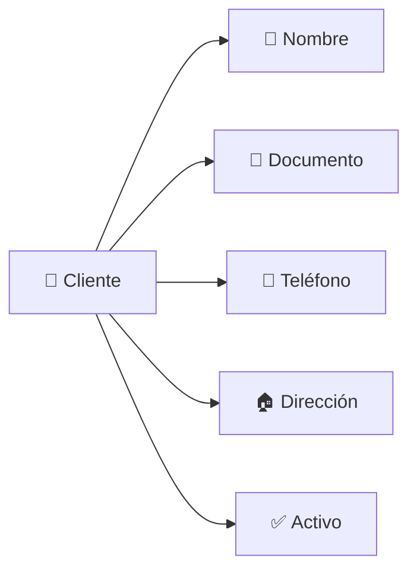
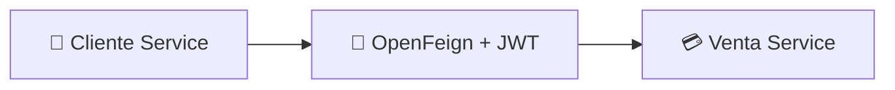
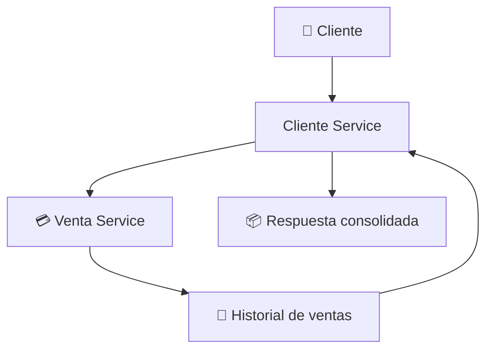

<div align="center">

# 👤 Cliente Service

### Microservicio de gestión de clientes
#### ElectrodoStore · Spring Boot · OAuth2 Resource Server · OpenFeign


</div>

---

Cliente Service es responsable de la gestión de identidades de negocio dentro de **ElectrodoStore**.

Administra la información comercial de los clientes y expone operaciones de consulta, actualización y deshabilitación, manteniendo separación respecto al dominio de autenticación gestionado por Auth Service.

Implementa seguridad basada en **OAuth2 Resource Server**, ownership mediante claims JWT e integración distribuida con Venta Service.

---

## 🎯 Responsabilidades

- 👤 Gestión de clientes
- ✏️ Actualización de información comercial
- 🚫 Deshabilitación lógica de clientes
- 📜 Consulta de historial de ventas
- 🔐 Protección basada en ownership
- 📡 Propagación de identidad entre microservicios

---

## 🧰 Stack tecnológico


---

## 📦 Modelo de dominio



### Entidad Cliente

| Campo | Descripción |
| --- | --- |
| `id` | Identificador del cliente |
| `name` | Nombre completo |
| `cellphone` | Teléfono de contacto |
| `document` | Documento único |
| `address` | Dirección |
| `active` | Estado del cliente |

---

## 🔐 Modelo de seguridad

Cliente Service funciona como **OAuth2 Resource Server**. Los JWT son emitidos por Auth Service y validados localmente mediante RSA256.

### Claims utilizados

| Claim | Descripción |
| --- | --- |
| `sub` | Username autenticado |
| `userId` | Identificador interno del usuario |
| `clientId` | Identificador del cliente |

---

## 👤 Ownership

Las operaciones sobre la identidad comercial utilizan el claim `clientId` obtenido desde el JWT, lo que evita que un usuario pueda:

- Consultar información de otros clientes
- Modificar datos de otros clientes
- Consultar ventas asociadas a otras cuentas

### Endpoints propios

| Método | Endpoint |
| --- | --- |
| `GET` | `/clientes/me` |
| `PUT` | `/clientes/me` |
| `PATCH` | `/clientes/me` |
| `GET` | `/clientes/me/ventas` |

> La identidad de negocio utilizada por estas operaciones proviene exclusivamente del claim `clientId`.

---

## 🔄 Relación con Auth Service

Cliente Service y Auth Service representan dominios distintos.

<table>
<tr>
<th>🔐 Auth Service</th>
<th>👤 Cliente Service</th>
</tr>
<tr>
<td>

- Usuarios
- Roles
- Permisos
- Autenticación

</td>
<td>

- Información comercial
- Datos de contacto
- Historial comercial

</td>
</tr>
</table>

> Ambos dominios se relacionan mediante el identificador `clientId`.

---

## 🚫 Deshabilitación de clientes

El servicio implementa borrado lógico mediante el atributo `active`. Cuando un cliente es deshabilitado:

- Conserva su historial de ventas
- Conserva referencias históricas en otros dominios
- Mantiene la integridad de la información comercial

> No se elimina información de forma física de la base de datos.

---

## ⚠️ Regla de negocio: identidad vs actividad comercial

La deshabilitación de un cliente **no implica** la eliminación de su usuario autenticable.

<table>
<tr>
<th>✅ Puede</th>
<th>❌ No puede</th>
</tr>
<tr>
<td>

- Iniciar sesión
- Consultar información histórica
- Consultar ventas
- Consultar su carrito

</td>
<td>

- Registrar nuevas compras
- Completar procesos de compra
- Cancelar operaciones comerciales restringidas

</td>
</tr>
</table>

> Esta separación permite preservar el acceso a información histórica sin habilitar actividad comercial.

---

## 🔗 Integración con Venta Service



### Integración disponible

| Servicio | Propósito |
| --- | --- |
| `venta-service` | Consulta de ventas asociadas a clientes |

**Características:**

- 🔗 Comunicación síncrona vía OpenFeign
- 🪙 Propagación automática del JWT
- 🔍 Descubrimiento dinámico mediante Eureka
- ⚖️ Balanceo mediante Spring Cloud LoadBalancer

---

## 📜 Consulta de ventas

Cliente Service consume Venta Service para consolidar información comercial.



---

## 🛡️ Resiliencia

Las integraciones con Venta Service están protegidas mediante:

| Mecanismo | Propósito |
| --- | --- |
| **Retry** | Reintentos automáticos ante fallos transitorios |
| **Circuit Breaker** | Aislamiento de fallos |
| **Fallback** | Respuestas controladas ante degradación |

> Esto evita propagación de errores de infraestructura hacia los consumidores.

---

## ⚠️ Manejo de errores

Se utiliza manejo centralizado mediante `@RestControllerAdvice`, códigos de error de dominio, respuestas consistentes y traducción de errores distribuidos.

```json
{
  "timestamp": "...",
  "status": 404,
  "error": "NOT_FOUND",
  "errorCode": "CLIENT_NOT_FOUND",
  "mensaje": "Cliente no encontrado"
}
```

---

## 🌐 Endpoints

### 👨‍💼 Administración

| Método | Endpoint | Descripción |
| --- | --- | --- |
| `GET` | `/clientes` | Listar clientes |
| `GET` | `/clientes/{id}` | Obtener cliente |
| `GET` | `/clientes/{clientId}/ventas` | Consultar ventas de un cliente |
| `PUT` | `/clientes/{id}` | Actualización completa |
| `PATCH` | `/clientes/{id}` | Actualización parcial |

### ⚙️ Operacionales

| Método | Endpoint | Descripción |
| --- | --- | --- |
| `GET` | `/clientes/{id}/enabled` | Consultar cliente habilitado |

### 👤 Cuenta propia

| Método | Endpoint | Descripción |
| --- | --- | --- |
| `GET` | `/clientes/me` | Obtener perfil |
| `PUT` | `/clientes/me` | Actualizar perfil completo |
| `PATCH` | `/clientes/me` | Actualización parcial |
| `GET` | `/clientes/me/ventas` | Consultar ventas propias |

### 🔗 Integración interna

| Método | Endpoint | Descripción |
| --- | --- | --- |
| `POST` | `/clientes` | Registro de cliente desde Auth Service |

### 📤 Endpoint compartido

| Método | Endpoint | Uso |
| --- | --- | --- |
| `PATCH` | `/clientes/{id}/disable` | Deshabilitación de identidad de negocio |

> Actualmente este endpoint puede ser utilizado tanto por administradores como por Auth Service durante la sincronización al deshabilitar usuarios con rol `CLIENT`.

---

## 🏗️ Arquitectura

- 🌐 API Gateway como punto único de entrada
- 🔐 JWT validado localmente mediante OAuth2 Resource Server
- 👤 Ownership basado en claim `clientId`
- 🔗 Comunicación síncrona mediante OpenFeign
- 🔍 Descubrimiento dinámico mediante Eureka
- 🛡️ Resiliencia mediante Retry y Circuit Breaker
- 🗄️ Database per Service
- 🧩 Separación entre identidad de seguridad e identidad de negocio

---

## 💡 Decisiones de diseño

<details>
<summary><b>🧩 Separación de dominios</b></summary>
<br>
Cliente Service no administra usuarios, credenciales ni permisos. La autenticación pertenece a Auth Service, mientras que Cliente Service administra únicamente la identidad comercial.
</details>

<details>
<summary><b>👤 Ownership basado en JWT</b></summary>
<br>
Las operaciones sobre recursos propios utilizan el claim <code>clientId</code> como identidad de negocio, evitando exponer identificadores sensibles en solicitudes del cliente.
</details>

<details>
<summary><b>🚫 Borrado lógico</b></summary>
<br>
La deshabilitación de clientes preserva información histórica y evita inconsistencias en otros dominios.
</details>

<details>
<summary><b>📡 Propagación de identidad</b></summary>
<br>
Las integraciones distribuidas mantienen el contexto de seguridad mediante JWT propagado automáticamente por OpenFeign.
</details>

<details>
<summary><b>🗄️ Database per Service</b></summary>
<br>
Cliente Service mantiene su propia base de datos y no accede directamente a bases de datos externas.
</details>

---

## 🚀 Mejoras futuras

| Mejora | Descripción |
| --- | --- |
| 🔑 **M2M Auth** | Autenticación específica entre microservicios |
| 📡 **Observabilidad** | Tracing distribuido y métricas |
| 📄 **Paginación** | Consultas administrativas paginadas |
| 📋 **Auditoría** | Registro de operaciones críticas |
| 📨 **Eventos** | Integración asíncrona mediante Kafka o RabbitMQ |
| 🔄 **Sincronización desacoplada** | Eventos de dominio para coordinación con Auth Service |
